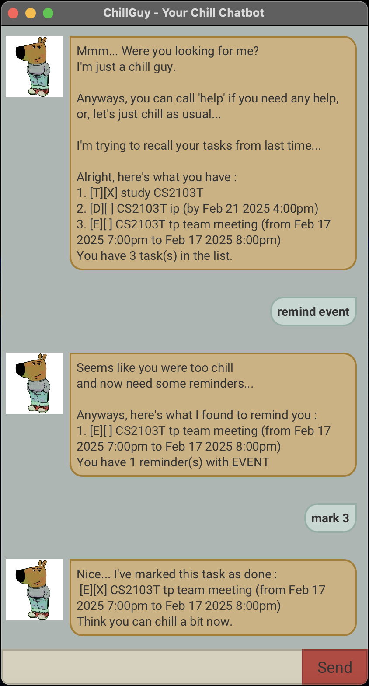

# ChillGuy



> "When your to-do list is full of overdue ones, but you are just a chill guy." - Chill Guy

ChillGuy is here to just chill most of the time but also take care of things you need to do.

ChillGuy is a **command-line optimized task manager desktop app** with a **chatbot-style Graphical User Interface (GUI)**,
designed to help you manage tasks efficiently while keeping things chill.

* Table of Contents
{:toc}

--------------------------------------------------------------------------------------------------------------------

## Quick start

1. **Prerequisites**: Ensure you have Java 17 or later installed on your computer.
   - **Mac users**: Make sure to install the exact JDK version recommended [here](https://se-education.org/guides/tutorials/javaInstallationMac.html).

2. **Download**: Get the latest `.jar` file from [here](https://github.com/juneha1120/ip/releases).

3. **Setup**: Move the downloaded `.jar` file to your preferred home folder for ChillGuy.

4. **Run the Application**:
   - Open a **command terminal**.
   - Navigate to the folder where you placed the `.jar` file using `cd`.
   - Run the application with: `java -jar chillguy.jar`
   - In a few seconds, a chatbot-style GUI should appear.

5. **Using ChillGuy**:
   - Type the command in the command box and press **Enter** or **Send button** to execute it.
   - **Example**: Typing `help` and pressing **Enter** will display available commands.

--------------------------------------------------------------------------------------------------------------------

## Features

> :information_source: [NOTE]  
> **Notes about the command format**:
> * Words in `UPPER_CASE` are the parameters to be supplied by the user.
> * Extraneous parameters for commands that do not take in parameters (such as help, show tasks, bye) will be ignored. 
> e.g. if the command specifies bye 123, it will be interpreted as bye.
> * Command words are case-insensitive.<br>

### Viewing help: `help`

Shows a list of available commands.

Format: `help`

ChillGuy replies with the list of available commands.

```
I'm the best at chilling,
but I can do these too...

# todo
# deadline
# event
# show tasks
# show tasks on
# find
# remind
# mark
# unmark
# delete
# bye

You can also learn specific command by
help <command name>
```

> :bulb: [TIP]  
> You can view the details of each command by:
> 
> Format: `help COMMAND_NAME`
> 
> Example: `help todo`
> 
> Chillguy replies with the details of specified command.

### Adding a todo: `todo`

Adds a todo task without any specific date/time.

Format: `todo TASK_NAME`

Example: `todo study CS2103T`

ChillGuy replies with the added todo and the current number of tasks in the list.

```
Gotcha... I've added this task:
[T][ ] study CS2103T
Now you have 1 task(s) in the list.
But remember, you can always chill first.
```

### Adding a deadline: `deadline`

Adds a deadline task with a specified due date/time.

Format: `deadline TASK_NAME /by DUE_DATE_TIME`

Example: `deadline study CS2103T /by 21/02/2025 16:00`

ChillGuy replies with the added deadline and the current number of tasks in the list.

```
Gotcha... I've added this task:
[D][ ] study CS2103T (by Feb 21 2025 4:00pm)
Now you have 1 task(s) in the list.
But remember, you can always chill first.
```

### Adding an event: `event`

Adds an event task with a specified start date/time and end date/time.

Format: `event TASK_NAME /from START_DATE_TIME /to END_DATE_TIME`

Example: `event study CS2103T /from 17/02/2025 18:00 /to 17/02/2025 20:00`

ChillGuy replies with the added event and the current number of tasks in the list.

```
Gotcha... I've added this task:
[E][ ] study CS2103T (from Feb 17 2025 6:00pm to Feb 17 2025 8:00pm)
Now you have 1 task(s) in the list.
But remember, you can always chill first.
```

### Listing all tasks: `show tasks`

Shows the list of all tasks in the task list.

Format: `show tasks`

ChillGuy replies with the list and the current number of tasks in the list.

```
Seems like you were too chill
and forgot what you had...

Anyways, here's what you have:
1. [T][ ] study CS2103T 
You have 1 task(s) in the list.
```

### Listing tasks on specific date: `show tasks on`

Shows tasks in the task list on a specified date.

Format: `show tasks on DATE_TIME`

Example: `show tasks on 21/02/2025`

ChillGuy replies with the tasks and the number of tasks on the specified date.

```
Seems like you were too chill
and forgot what you had...

Anyways, here's what you have:
1. [D][ ] study CS2103T (by Feb 21 2025 4:00pm)
You have 1 task(s) on Feb 21 2025.
```

### Finding tasks with keyword: `find`

Finds tasks in the task list with a specified keyword.

Format: `find KEYWORD`

Example: `find CS2103T`

ChillGuy replies with the tasks and the number of tasks with the specified keyword.

```
Seems like you were too chill
and forgot what you had...

Anyways, here's what I found matching:
1. [T][ ] study CS2103T
You have 1 task(s) with keyword : CS2103T.
```

### Reminding a specific type of task: `remind`

Reminds tasks in the task list with a specified type for today.

Format: `remind TASK_TYPE`

Example: `remind deadline`

ChillGuy replies with the reminders and the number of reminders with the specified type for today.

```
Seems like you were too chill
and now need some reminders...

Anyways, here's what I found to remind you:
1. [D][ ] study CS2103T (by Feb 21 2025 4:00pm)
You have 1 reminder(s) with DEADLINE.
```

### Marking a task: `mark`

Marks a specified task as done.

Format: `mark TASK_NUMBER`

Example: `mark 1`

ChillGuy replies with the marked task.

```
Nice... I've marked this task as done:
[T][X] study CS2103T
Think you can chill a bit now.
```

### Unmarking a task: `unmark`

Marks a specified task as not done.

Format: `unmark TASK_NUMBER`

Example: `unmark 1`

ChillGuy replies with the unmarked task.

```
Ok... I've marked this task as not done yet:
[T][ ] study CS2103T
But no worries,
you are always welcome to just chill.
```

### Deleting a task: `delete`

Deletes a specified task from the task list.

Format: `delete TASK_NUMBER`

Example: `delete 1`

ChillGuy replies with the delete task and the number of tasks in the list.

```
Noted... I've removed this task:
[T][ ] study CS2103T
Now you have 0 task(s) in the list.
You know what, I also thought
we didn't really need that.
```

### Exiting the chatbot: `bye`

Exits the chatbot.

Format: `bye`

ChillGuy replies with the following message.

```
Bye...
Hope to see you and chill together again soon...
```

### Saving the data

ChillGuy data are saved in the hard disk automatically after any command that changes the data.  
There is no need to save manually.

### Editing the data

ChillGuy data are saved automatically as a text file `chillguy.txt`.  
Advanced users are welcome to update data directly by editing that data file.

> :warning: [WARNING]  
> If your changes to the data file makes its format invalid, ChillGuy will discard invalid lines 
> and start with valid lines only. Hence, it is recommended to take a backup of the tile before editing it.

--------------------------------------------------------------------------------------------------------------------

## Command summary

| Command                               | Format, Example                                                                                                                        |
|---------------------------------------|----------------------------------------------------------------------------------------------------------------------------------------|
| **Adding a todo**                     | `todo TASK_NAME` <br> e.g., `todo study CS2103T`                                                                                       |
| **Adding a deadline**                 | `deadline TASK_NAME /by DUE_DATE_TIME` <br> e.g., `deadline study CS2103T /by 21/02/2025 16:00`                                        |
| **Adding an event**                   | `event TASK_NAME /from START_DATE_TIME /to END_DATE_TIME` <br> e.g., `event study CS2103T /from 17/02/2025 18:00 /to 17/02/2025 20:00` |
| **Listing all tasks**                 | `show tasks`                                                                                                                           |
| **Listing tasks on specific date**    | `show tasks on DATE_TIME` <br> e.g., `show tasks on 21/02/2025`                                                                        |
| **Finding tasks with keyword**        | `find KEYWORD` <br> e.g., `find CS2103T`                                                                                               |
| **Reminding a specific type of task** | `remind TASK_TYPE` <br> e.g., `remind deadline`                                                                                        |
| **Marking a task**                    | `mark TASK_NUMBER` <br> e.g., `mark 1`                                                                                                 |
| **Unmarking a task**                  | `unmark TASK_NUMBER` <br> e.g., `unmark 1`                                                                                             |
| **Deleting a task**                   | `delete TASK_NUMBER` <br> e.g., `delete 1`                                                                                             |
| **Viewing help**                      | `help`                                                                                                                                 |
